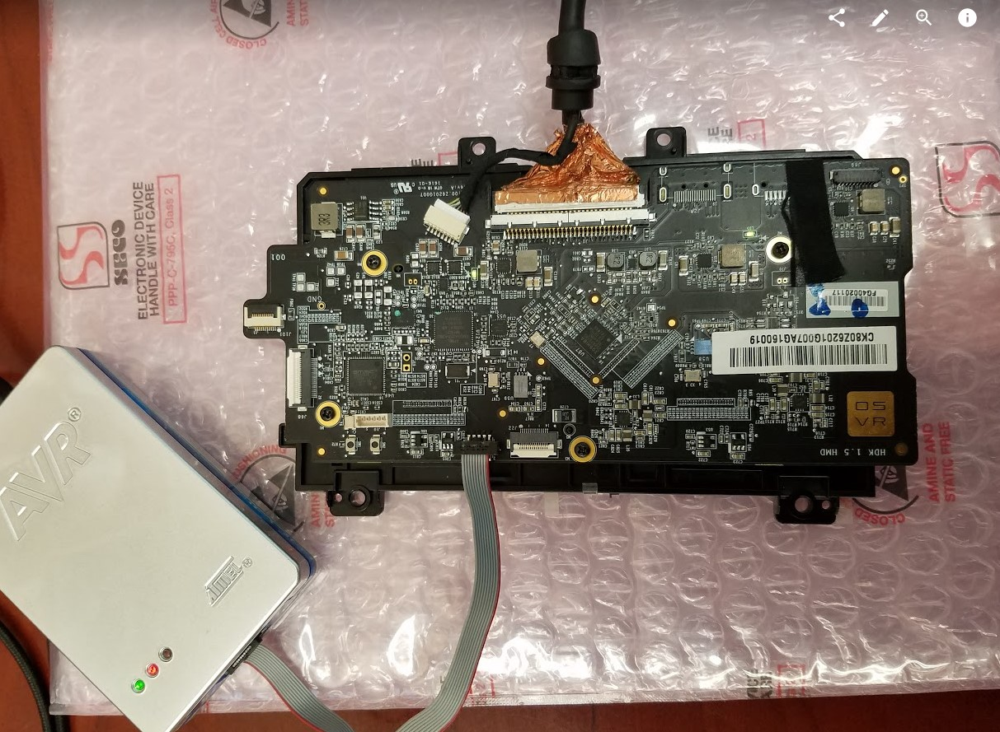
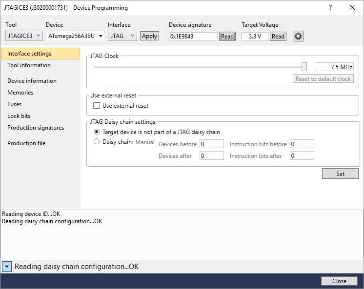
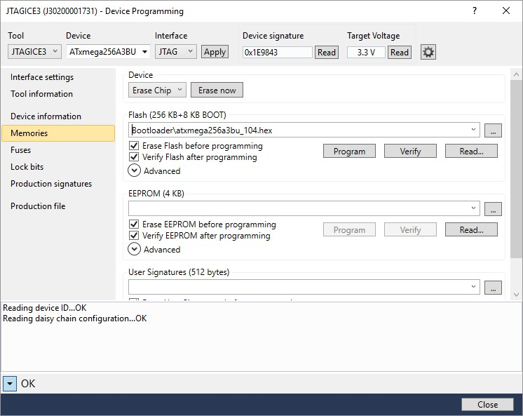

#Preparing HDK2 board to enter bootloader mode

## Step 1: Connect programmer to HDK2 board

Connect progammer such as [Atmel JTAGIce3](http://www.atmel.com/tools/JTAGICE3.aspx) to the programming port on the HDK board.

## Step 2: Prepare for bootloader programming

- Enter device programming dialog (enter through Tools/Device Programming) in Atmel Studio
- Select “Interface settings”
- Select tool and JTAG interface.
- Select “ATxmega256A3BU” as device
- Click “Apply”
- Click “Read” in the “device signature” area. If interface is connected correctly and board is powered on, the device signature will appear

## Step 3: Program bootloader

- Enter ‘Memories’ tab
- Select bootloader file (atxmega256a3bu_104.hex) which you can obtain from the "AVR1916: USB DFU Boot Loader for Atmel XMEGA" application note [here](http://www.atmel.com/devices/atxmega256a3u.aspx?tab=documents)
- Click program

The HDK will now be ready for regular firmware update using the OSVR Control tool
