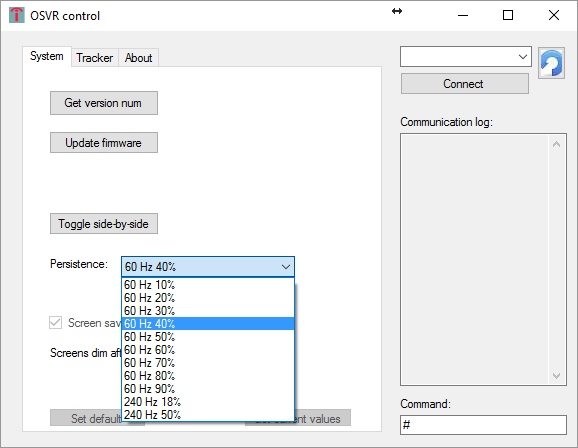

# OSVR HDK 1.x
## OSVR Server Configs

The default server configuration on Windows is suitable for an HDK 1.3 or 1.4, optionally using video-based (positional) tracking fused with IMU (orientation-only) sensor data, running in direct mode: it's a copy of the `osvr_server_config.HDK13DirectMode.sample.json` file from the `sample-configs` directory.

### Improved distortion correction
If you're using applications that have been built with RenderManager versions 0.6.40 or newer, you may choose to use `osvr_server_config.HDK13DirectModeMesh.sample.json` instead - it is the same except it uses a built-in mesh distortion rather than a polynomial function for distortion correction, which results in a more accurate display.

### Non-direct mode
The similarly named sample configs

- `osvr_server_config.HDK13ExtendedPortrait.sample.json`
- `osvr_server_config.HDK13ExtendedPortraitMesh.sample.json`
- `osvr_server_config.HDK13ExtendedLandscape.sample.json`

will work if you cannot use Direct Mode - the same caveat as with direct mode above applies if you wish to use the "mesh" config. Note that you may need to modify the `sample-configs/renderManager.extended.portrait.json` or `sample-configs/renderManager.extended.landscape.json` configuration files, respectively, to set `xPosition` and `yPosition` of where the HDK screen starts on your desktop.

### HDK 1.2 and earlier
HDK versions 1.2 and earlier can use the config files named identically to those for the 1.3 except with `12` replacing `13`:

- `osvr_server_config.HDK12DirectMode.sample.json`
- `osvr_server_config.HDK12ExtendedPortrait.sample.json`
- `osvr_server_config.HDK12ExtendedLandscape.sample.json`

There is no mesh variant for the 1.2 and earlier as the optics module on these versions does not require it.

## Video modes
### Input resolutions
The OSVR HDK supports two input resolutions:
- 1080x1920 @ 60 FPS. This is the native video mode and carries the lowest latency with it
- 1920x1080 @ 60 FPS. When the HDK detects this video mode, it automatically performs 90 degree rotation in hardware, to bring this to the native screen resolution of 1080x1920. This 90 degree rotation carries 1 frame (16 mSec) of latency because an entire frame needs to be stored in the HDK memory before being sent to screen. However, this mode is useful in two main use cases:
  - When you want to mirror the desktop
  - When you want to use a wireless video link that does not support 1080x1920 resolution

The HDK reports back using an HID message whether it is detecting video at all, and whether it is receiving 1920x1080 or 1080x1920. See report format in the [HID protocol definition for the OSVR HDK](../Developing/OSVRhdk.md)

### Side by side
The OSVR HDK is usually driven by applications that generate different left and right eye imagery in side-by-side mode. However, it is sometimes useful to replicate the entire image over both eyes. For instance:
  - When viewing the regular desktop from within the HMD
  - When using an application that does not render side-by-side

The user can control which of these modes is being used using the [OSVR HDK Configuration utility](../Utilities/OSVRControl.md). In the utility, use the "Toggle side-by-side" button

### Persistence settings

You can configure the OLED persistence settings through a terminal port or the [OSVR Control utility](../Utilities/OSVRControl.md)

