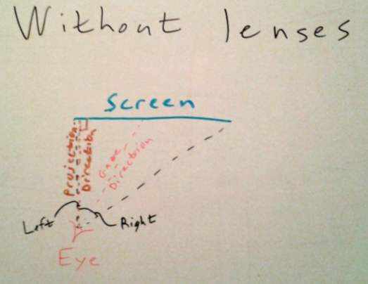
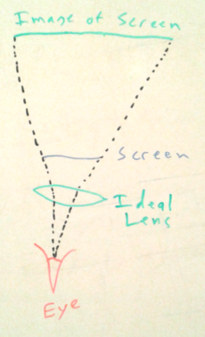
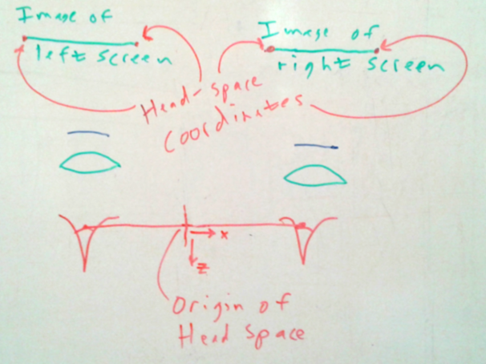

# OSVR viewing transformations

This document describes the OSVR viewing transformations, including the projection matrix and the portions of the modelview matrix required to set the viewpoint. See the [distortion document](./distortion.md) for how to handle distortion correction (non-ideal lenses, non-planar display surfaces).

The discussion below ignores the effects of eye tracking, and it also ignores the fact that the center of projection of the eye is not the same as its center of rotation.  For any particular view direction, the center of projection is along the viewing direction in front of the center of rotation, so the approximation is slight.  **With eye tracking** the only change is to move the eye position from the center of rotation of the eye to the center of its entrance pupil.

## Overview

The purpose of the combined projection and view matrix are to provide a geometric description of how to properly project 3D points onto a rectangular planar screen that the viewer is looking at in such a way that they appear to remain fixed in space as the viewer's head moves and rotates.

This requires determining the location of each eye and screen in the same coordinate system.  Following the model in [The Visual Display Transformation for Virtual Reality](http://www.cs.unc.edu/techreports/94-031.pdf), we call this coordinate system *Room Space*, a space that is rigidly attached to the physical room or vehicle where the user is located.

When we are dealing with fixed-screen displays: head-tracked stereo on a monitor, CAVE displays, or VR desk designs, the screen remain fixed in room space and the eyes move around.  When we are dealing with head-mounted displays, each screen moves along with the eyes and remains at the same location in eye space.  Although this affects how we track and determine these locations, it does not affect the basic mathematics involved.

To make the discussion easier to draw and easier to understand, it is presented initially for the 2D case.  (The 3D case has orthogonal solutions for the two screen directions, but adds two more orientations.)

## Without Lenses

The image below shows the situation without lenses.  This is the case for fixed-screen displays, but an approximation for head-mounted configurations.  We'll add lenses later.  The discussion is in physical-world units, rather than pixel/viewport units.

The two ends of the screen and eye position are all that is needed to determine the projection and view matrices.  Determining each them is described below.  Once they are available, the view and projection matrices can be constructed.  (At one time, the model, view, and projection matrices were well defined and performed separate functions.  Current implementations provide full matrices for each of them, so which does what part of the calculation is up to the implementer.  This initial discussion describes the operations that are applied rather than how they are applied.)

**Projection:** The result of projection is a 2D image on a planar projection surface.  To appear correctly when drawn on the screen, this projection surface needs to be parallel to the physical screen and it must subtend the same region on the retina.  It can be moved closer or further to the eye, but then must be scaled so that its edges are at the same projected locations as the real screen.  This is easiest to think about in terms of angles and a viewing direction, which are independent of depth.

It is tempting to project along the presumed *gaze direction*, which is towards the center of the screen.  However, doing so would project onto a planar surface that is not parallel to the screen.  To make the two parallel, the *projection direction* must be perpendicular to the screen, projecting along its normal.  Note that this may make the center of projection lie outside the screen if the gaze direction is sufficiently off-center ("off-axis" projection).  Given this unique projection direction, two angles can be specified, one for each edge of the screen.  One rotates the projection direction to point towards the *Left* edge of the screen (a slight positive rotation in the figure above) and the other to point to the *Right* edge of the screen (a large negative rotation in the figure above).

**View:** The job of the view matrix (or the view portion of the projection matrix) is to transform the center of projection to *world space" (where the graphical objects to be rendred live).  This requires translating the origin in *eye space* moves to its location in *world space* and also rotating so that the -Z axis in *eye space* is looking along the projection direction in *world space*.  Together with the projection, this will take 3D points in world space and project them onto a virtual screen whose projection matches that of the physical screen onto the center of the physical viewer's eye (assuming everything is properly calibrated).

### Going to 3D

Going from the 2D-to-1D projection example above to a 3D-to-2D projection requires another translation to set the vertical location of the eye with respect to the screen.  It also requires two more rotations.  These rotate the world so that the X axis in eye space is parallel to the X axis in screen space (from left to right) and the Y axis is parallel to the Y axis in screen space (from bottom to top).  Together with the Z rotation, this aligns the four corners of the virtual screen with the corners of the physical screeen.

**Implementing:** These transformations must ultimately be implemented in the graphics library being used to display the world.  These libraries, *OpenGL*, *Direct 3D*, *Unreal*, each have their own coordinate systems.  Some of the them are right-handed, and some left-handed.  Some have the origin at the upper-left corner of the screen and some at the lower left.  Some have specified world-space units (meters, centimeters) and some do not.  The coordinate system being described in this document is the OSVR internal system.  OSVR includes utility adapters (some in *Core*, some in *RenderKit*) to convert its internal representations of viewports, modelview, and projection matrices to various libraries.  Other plug-ins handle this conversion internally.

### Finding Eye Space

In OSVR, *Head space* is defined with its origin halfway between the center of rotation of the eyes, with its X axis pointing towards the right eye, its Y axis pointing up, and its Z axis pointing towards the back of the head.  Getting from room space to head space is the job of the tracking and interaction systems and is another discussion.  Getting from head space to *Eye space* is a matter of translating along the X axis by half of the inter-pupillary distance (*IPD*) in +X for the right eye and -X for the left.

### Finding Screen Edges

For fixed-screen displays, the location of the screen must be measured or constructed such that the location of the edges is known in room space.  For head-mounted displays, such as the *OSVR HDK*, the screen locations are fixed in *eye space*.  This means that the projection portion of the matrix remains fixed for a given eye as the viewer's head moves around the environment (it lives in *eye space*, so follows along).

Because the screens in the HMD are too close for most viewers to focus on, HMD displays employ lenses to turn the physical screen into a virtual image.  The impact of this is described in the next section.

## With Idealized Lenses

An ideal lens magnifies or minifies all of the objects behind it, scaling their size and distance consistently.  This is shown in the figure below to enlarge the screen and move it further away, producing an image of the screen that is parallel to the actual screen but located behind it.  Note that the rays through the lens bend, causing the image to appear larger than a direct projection would be, giving a wider field of view.

The algorithm for determining the projection and viewing transforms remains the same as it was above, except for the fact that now all of the measurements need to be made to the image of the screen rather than to the physical screen.  This is not theoretically challenging, but it is a practical challenge for determining the parameters if the characteristics of the lens are not known because the edges of the screen may not be visible through the lens.  Assuming you know the lens characteristics and the physical size and location of the screen with respect to the lens, you can compute the location of the image.  If not, some sort of calibration is needed (see below).

### Adjustable Lenses

Some head-mounted displays, such as the *OSVR HDK*, let the user adjust the location of the lenses to make room to insert eyeglasses into the display and to adjust the width so that their pupils stay within the *exit pupil* of the lens (the region where it behaves like an ideal lens).

An example from a lens system used in early versions of the OSVR HDK: As the lens moves with respect to the real screen, the position and size of the image of the screen move with respect to the eye.  As the lens is moved closer to the screen (further from the eye), the image of the screen appears to get larger, producing a larger field of view.  As the lens was moved to the left, the image of the screen appeared to move to the right.  When the lens is left stationary and the eye is moved within the exit pupil, the image of the screen appears to remain the same.  (When the eye is moved outside the exit pupil, distortion is seen; distortion is described in the [distortion document](./distortion.md).)

### Idealized-Lens Solution

So long as the viewer's pupil remains in the exit pupil of the lens (the *exit pupil* is sometimes referred to as the *eye box*), the projection matrix and viewing transform should be based on the actual center of projection of the eye (based on the IPD) rather than based on the nominal center of the exit pupil for the lens.

If the viewer's pupil goes beyond the exit pupil of the lens, causing distortion, then the HMD lens locations should be adjusted, or the lenses swapped out and then the system recalibrated and re-specified as described below.

## Specification

(The following describes the theoretical, most-general description of a screen, for a description of how to specify these parameters in the current OSVR configuration files, see @todo).

**Fixed Rectangular Screen:** The specification of rectangular fixed-screen systems is done by specifying the room-space coordinates of the lower-left, lower-right, and upper-left corners in meters.  In the case where the vectors from the lower-left corner to the lower-right and upper-left corners are not orthogonal, the projection of the upper-left coordinate onto the plane perpendicular to the vector from the lower-left to lower-right corner will be used as the upper-left corner (which will reduce the screen height).  These coordinates are specified in meters.

**Head-Mounted Displays (HMDs):** The screens in a given head-mounted display may be mounted at any angle with respect to each other and with respect to the device and the viewer's relative eye positions.  Adjustment of the lens locations can further change the location and size of the images of the screens.  The lack of a standard for fiducials on head-mounted displays and the fact that they can be individually adjusted means that no coordinate system can be defined with respect to the HMD itself that will be correct in all circumstances.

The **OSVR screen specification for HMDs with ideal lenses** describes the location of the corners of the image of the screen with respect to OSVR's *Head Space*, which has its origin halfway between the center of rotation of the eyes, its X axis pointing towards the right eye, its Y axis pointing up, and its Z axis pointing towards the back of the head.  There is a separate definition for each screen.  Although the viewing and projection matrices will depend on the viewer's IPD, the screen location depends only on the lens locations and parameters (presuming that the viewer's eyes lie within the exit pupils for each lens).  For each eye, the screen is specified by providing three sets of 3D coordinates: the image of the screen's lower-left corner, its lower-right corner, and its upper-left corner.  These corners are the locations of the image of the screen even if those locations are not visible to the viewer through the lenses (this can make calibration challenging and is dealt with in a later section).  As for fixed rectangular screens, in the case where the vectors from the lower-left corner to the lower-right and upper-left corners are not orthogonal, the projection of the upper-left coordinate onto the plane perpendicular to the vector from the lower-left to lower-right corner will be used as the upper-left corner.

The **OVR screen specification for HMDs whose lenses introduce distortion**, along with the specification for **fixed curved screens** is described in the [distortion document](./distortion.md).  The basic approach is for the distortion correction to map pixels from the physical display onto an image of a rectangle (or subset of a rectangle) and then to use three corners of this rectangular image (which may not be visible) as described above.

**Discarded Designs:** Other options for screen description that were considered and discarded include: (1) Center of screen, orientation of screen, screen width and height (discarded because of the difficulty in specifying orientation).  (2) Four corners of the screen (discarded because it further over-specifies the geometry and can lead to inconsistent specification).

## Aspect Ratios

Note that the viewport width is proportional to the tangent of the half-width of the horizontal field of view, and the height to that of the vertical field of view.  This means that for non-square aspect ratios, the ratio of the window width/height is not directly proportional to the ratio of the HFOV/VFOV.  This means that **you cannot multiply the horizontal field of view by the ratio of the display size in pixels to compute the vertical field of view**.

For example, the horizontal field of view on the OSVR HDK version 1.2 is 90 degrees and it covers half of the screen (1920/2).  It is **incorrect** to compute the vertical field of view using 90 / (1920/2) * 1080 = 101.25 degrees.  The **correct calculation is atanDegrees( (tanDegrees(95/2) / (1920/2) * 1080) ) * 2 = 96.73 degrees**.  The diagonal field of view multiplies by the screen diagonal size in pixels (1445) rather than 1920/2 to get a **diagonal field of view of 112.8 degrees.**

For example, the Sensics dSight has a horizontal field of view of 95 degrees and a screen ratio of 1920x1080.  It is **incorrect** to compute the vertical field of view using 95 / 1920 * 1080 = 53.43 degrees.  The **correct calculation is atanDegrees( (tanDegrees(95/2) / 1920 * 1080) ) * 2 = 63.1 degrees**.  The diagonal field of view multiplies by the screen diagonal size in pixels (2202.9) rather than 1920 to get a **diagonal field of view of 102.8 degrees.**

## Calibration
@todo

**Useful tidbits:** For the OSVR HDK 1.3 (with slider to adjust optics forward and backwards), the active area of the display is 120.96mm, so that each half screen is 60.48mm wide.  This puts the center of each half screen at 30.24mm from the middle of the screen.  The center of the each lens is 32mm from the center of the screen and is looking directly perpendicular to the screen.  This makes its center of projection 0.471 in X on the left eye and 0.529 on the right.
