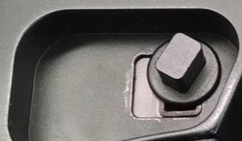
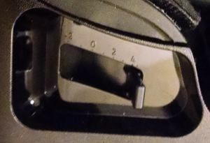

# Congrats on your Hacker Development Kit!

Esta es una traducción de "Getting Started", y como tal va a estar desactualizada, así que es probable que algunos datos sean inválidos.

## Identificando tu dispositivo
Las principales variedades de HDK en el mercado son HDK 1.2 y HDK 1.3 . Ambas vienen dentro de una caja de cartón con manija de transporte con logotipos de OSVR y generalmente incluye un kit de cámara IR.

> Nota: Si obtuviste tu HDK antes de mediados del 2015, particularmente si no trajo una lujosa caja ensamblada en una fábrica con una cámara IR, y/o posée una pantalla LCD en vez de una OLED, es posible que sea un prototipo anterior. Generalmente puedes tratarlo como un HDK 1.2, excepto que deberìas evitar actualizar el firmware sin contactar al soporte : No quisiéramos que instales un firmware para OLED en una unidad con LCD, y dado que el Hacker Development Kit está diseñado para ser hackeado, incluso hasta la pantalla, hacer eso es posible.
The main exterior difference between the 1.3 and preceding versions is the adjustments for the optics, so it's the easiest way to identify what you have if you are unsure:

- El HDK 1.2 y anteriores poseen ajustes a tornillo por debajo de cada ojo, con ajuste de distancia entre pupilas (IPD) y foco. Esta imagen es de un HDK 1.1, pero el mecanismo en el HDK 1.2 es efectivamente el mismo. 
- El HDK 1.3 posee ajustes deslizables debajo de cada ojo para el ajuste de foco ( óptica modificada para brindar un "eyebox" más grande ( zona tridimensional en la cual el ojo puede ver la imagen correctamente ) eliminó la necesidad para el ajuste de distancia entre pupilas (IPD) ). 

Existen diferencias generalmente encontradas entre los chipsets de las "belt boxes" del HDK 1.2  y 1.3, así que cuando tengas el pack de drivers instalados ( usando Windows ), eso puede ayudarte a recordarlo, pero las diferencias mecánicas son las más confiables.

## Advertencias/Limitaciones
- El archivo de configuración por defecto en Windows asume un HDK 1.3, renderizado en modo directo ( direct mode ), y seguimiento por fusión de IMU y video. En HDK 1.2 o si no puedes/quieres usar modo directo, es necesario cambiar el archivo de configuración. Hay archivos de configuración con nombres auto explicativos incluidos.
- El servidor OSVR actualmente muestra una consola que puede ser minimizada, pero no debe ser cerrada mientras usas una aplicación OSVR. Una interfaz más agradable o invisible está planeada.

## Configuración

### Conectando el HDK y la Cámara IR.
Hay un par de conecciones que hacer: HDK al beltbox, electricidad de la pared al beltbox, HDMI y USB entre el beltbox y tu PC.
El orden particular no importa. Mantén la precaución de no colocar el beltbox en una posición que estrangule o estire los cables.

Si usas seguimiento por video ( posicional ), asegurate de que el cable de sincronización esté conectado.

Una vez conectados el HDK, HDMI y cable de poder a la pared, el HDK debe ser reconocido como un display nuevo en la PC. Los usuarios de Windows pueden necesitar elegir "extender pantalla" en "Propiedades de Pantalla".
Usuarios de Linux: Pueden extender el display o ejecutar otra pantalla de X en el HDK, dependiendo del uso.

Probablemente se vea como un display de 1080x1920 "Retrato" por defecto. Este es el modo de mayor rendimiento. Sin embargo , actualmente la mayoría de las aplicaciones no funcionan en este modo, así que te conviene elegir la resolución de 1920x1080. ( Esto no significa que que debas cambiar la orientación , el HDK se encarga de eso internamente.)

En este punto debes tener la Cámara IR conectada, cuando menos para actualizar el firmware. Desafortunadamente al día de hoy el actualizador de firmware para la Cámara IR sólo funciona en Windows.

### Windows: Instalar el pack de drivers ( opcional pero recomendado )
Si te encuentras en Windows, hay un instalador del pack de drivers que puede mejorar tu experiencia. Si bien no es estrictamente necesario para un uso básico, provee mejores nombres para los dispositivos en el administrador de dispositivos, agrupa componentes de los dispositivos lógicamente con íconos correctos en "Dispositivos e Impresoras", y en Windows 8.1 ( y anteriores) es requerido para usar el software de control del OSVR HDK para actualizar el firmware, etc. ( Windows 10 ya posée el driver correcto, pero los otros beneficios aún se aplican).

Puedes encontrar la última versión en <https://github.com/OSVR/OSVR-HDK-Windows-Drivers/releases>. Descarga e instala antes de continuar.

### Verifica/Actualiza el firmware

Hay varias partes del sistema que tienen firmware que puede ser actualizado.
El **Firmware de la Cámara IR** actualizado es escencial, ya que las actualizaciones provéen mejoras substanciales de rendimiento como compatibilidad con Linux, OS X, y otros paquetes de software además del plugin de seguimiento por video de OSVR. En Windows, con drivers 1.2.6 o superior, desde INICIO, escribe "Dispositivos e Impresoras" y presiona Enter, y deberías ver un número de dispositivos vinculados a OSVR con íconos correspondientes a lo que tengas conectado.

Si el ícono de tu Cámara IR se ve así:

Click derecho, y elige "Get firmware upgrade". Alternativamente puedes ir a <http://osvr.github.io/using/>.

Una vez allí, debes buscar la descarga para el actualizador de firmware de la Cámara IR: va a estar marcado con este símbolo:

> ¿No usas Windows?: Si bien no puedes actualizar el firmware en tu sistema, puedes revisar y ver la versión del firmware, ya que es parte del ID del hardware USB. El ID del fabricante es 0x0bda, ID de producto es 0x57e8, y la versión del firmware es cualquiera que sea listada en el campo `bcdDevice` ( que figura como `REV_` en Windows).
> En Linux, `lsusb -v -d 0bda:57e8` presenta mucha información sobre el dispositivo, y `lsusb -v -d 0bda:57e8 | grep bcdDevice` presenta sólo la revisión 0.07 para versión 7, la última al tiempo de autoría de este documento. Si es menor, el firmware necesita actualizaciones.

**El procesador del HDK** también posee firmware.

Si posées un HDK 1.2, el firmware más reciente que necesitas es la versión **1.84** - versiones más nuevas contienen código específico para la pantalla OLED del 1.3. Ve las instrucciones para un [HDK 1.2 upgrade procedure](HDK-1.2-Firmware-Update.md) que instalará automáticamente este software, así como también automatizar el proceso de actualización del de los VID/PID del procesador en caso de que tengas una unidad antigua donde estos estén fallados.

En ambos 1.2 y 1.3 el OSVR HDK Control utility en Windows es el mejor lugar para actualizar el firmware y para ajustar algunas características especiales en el HDK. Puedes obtenerlo en <http://osvr.github.io/using/>. También puede reportar la versión actual del firmware que tienes instalado, etc.
El firmware del HDK se puede actualizar en Linux o Mac OS X, pero el proceso no fue completamente documentado aún. Si necesitas instrucciones, contacta al soporte y te ayudaremos , actualizando la documentación en el proceso.

### Obtener el OSVR Server
