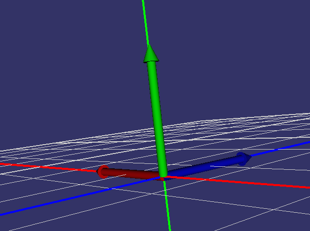
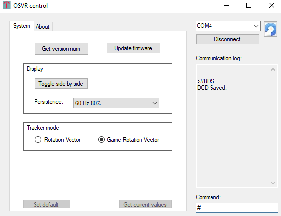

# Skewed Tracker Orientation
If the HDK tracker is skewed in a normal resting position, even after running osvr_reset_yaw.exe, it’s possible that the accelerometer is not well calibrated.

One parameter of accelerometers is called the Zero G Offset (ZGO).  This can vary from unit to unit and can change over time.  If you have a poorly calibrated accel ZGO, then it could look to the algorithm like it is slightly tilted.  The BNO070 has dynamic accelerometer calibration, but you have to induce certain motions for it to fully take effect. 

The accelerometer will be calibrated after the device is moved into 4-6 unique orientations and held in each orientation for ~3-4 seconds.  One way to think about this is the “cube” method.  Imagine that the headset is a standard cube with 6 faces (Front, Back, Left, Right, Top, Bottom).

Orient the headset so that it is sitting on each face of the cube sequentially.  For example, start with the device positioned normally (bottom face of the cube down).  Then orient it so that the right side of the cube is facing down.  Then continue through the rest of the faces of the cube.  Here’s a quick example:

Hold the headset in each orientation for about 3-4 seconds. It doesn’t have to be perfectly aligned with the cube – just 4-6 unique orientations (the more variation in orientations between those 4-6 the better, so faces of a cube is a good way to think about it).  And it doesn’t matter what order you move them into. 
When finished, try running OSVRTrackerView.exe.

 
If the issue has gone away you can run the following COM port command via OSVR Control to force the calibration to save to flash (this will happen automatically after 5 minutes but it’s not a bad idea to force it to do so).
 
"#BDS"
 
It should say “DCD Saved” if successful.

